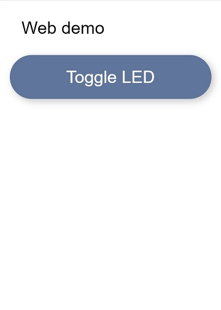

# ESPBase
---

A minimalistic Arduino project with WifiManager, OTA and a web server for ESP8266 and ESP32. A nice starting point for any new ESP projects.

## PlatformIO and Arduino IDE

The main branch contains code for usage with [PlatformIO](https://platformio.org/).
If you prefer using the old Arduino IDE, the [ArduinoIDE](https://github.com/ArveLarve/ESPBase/tree/ArduinoIDE) branch contains the code for this.

## Dependencies
### Libraires
- [ESP8266 Core for Android](https://github.com/esp8266/Arduino) (Arduino core for ESP8266 WiFi chip)
- [WifiManager](https://github.com/tzapu/WiFiManager) (ESP8266 WiFi Connection manager with fallback web configuration portal)
### Tools
- [LittleFS Filesystem Uploader](https://github.com/earlephilhower/arduino-esp8266littlefs-plugin) (Tool to upload data folder to LittleFS)

Make sure you have installed the dependencies according to their installation instructions for your environment


## How it works

### Connecting to wifi
As described in the WifiManager projects documentation:

- When your ESP starts up, it enters Station mode and tries to connect to a previously saved Access Point
- If this is unsuccessful (or no previous network saved) it puts itself into Access Point mode and starts a configuration webpage (default ip 192.168.4.1)
- Using any wifi enabled device with a browser (computer, phone, tablet) connect to the newly created Access Point
- On the captive portal webpage, choose one of the access points scanned, enter a password and click save
- The ESP will try to connect. If successful, it continues running your program


### Configure the Web server
The project comes with a simple web page that displays a list of buttons.

The buttons are generated from a javascript array of strings.
The `void handleJavascript()` function has an example with a single button "Test" and a link to a non-existent enpoint called `http://{your_ESP_IP}/led1`
The html code for the demo page is available in `data/index.html` in this repository.
Make sure to upload the contents of the data folder using the LittleFS file upload utility

### Demo page
The buttons are generated from an array of strings where the strings contain the button text and link seperated with a pipe symbol as shown here:
```
var buttonData = ['Toggle LED|/led1']
``` 

